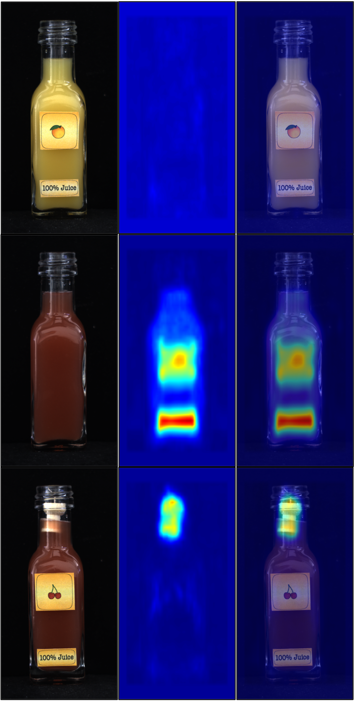
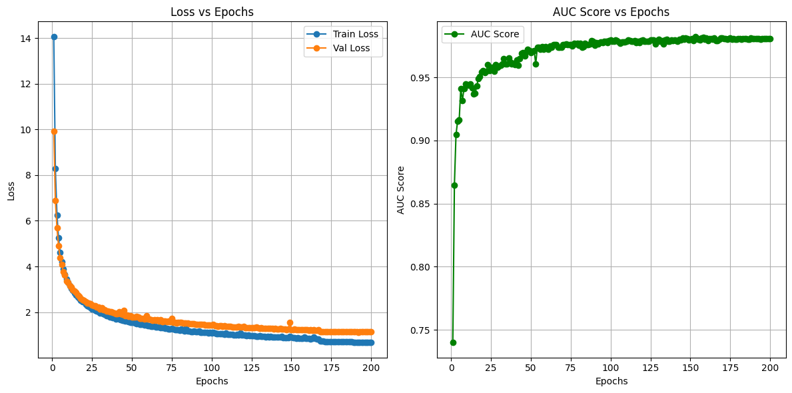

# EfficientAD

This repository is customized based on [EfficientAD](https://github.com/nelson1425/EfficientAD).

## Example of Inference Visualization (juice bottle)


## Loss history (juice bottle)


## Key Customizations

1. **Modularization:**
   - The codebase has been modularized for easier management and scalability.

2. **Training Process Update:**
   - The training loop has been adjusted from an iteration-based approach to an epoch-based approach.

3. **Loss Function Adjustment:**
   - The penalty loss has been removed when calculating \( L_{st} \).

4. **Visualization during Inference:**
   - Added support for visualization during the inference phase.

## Getting Started
Please refer to the original [EfficientAD documentation](https://github.com/nelson1425/EfficientAD) for setup instructions. This repository retains compatibility with the original setup process.

### Prerequisites
- Python 3.11
- Required libraries can be installed using:
  ```bash
  pip install -r requirements.txt
  ```

## Usage
To train the model:
```bash
python train.py -s "{dataset directory}" -m "{model size}"
```

To run inference with visualization:
```bash
python inference.py -t "{testset directory}" -m "{model directory}
```

